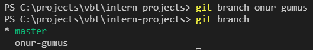
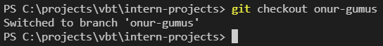

# Branch'ler ile Çalışma

Aslında farkında olmadan git kullanırken hep bir branch ile çalışıyoruz.
Varsayılan olarak gelen branch **master** veya **main** olarak adlandırılıyor.

Branch oluşturmak için **git branch ad-soyad** komutunu kullanıyoruz.

`git branch ad-soyad`

Yeni branch'ımızı oluşturduk fakat aktif etmedik şu anda **master** branch'ındayız.

Tüm branchları görüntülemek ve aktif branch'ımızı öğrenmek için **git branch** komutunu çalıştırıyoruz.

Aktif olan branch \* simgesi ile işaretlenmiş olacaktır.

`git branch`

Aktif olarak çalıştığımız branch'ı değiştirmek için iki tane git komutu bulunuyor.

Biri **git checkout** diğeri **git switch**, ikisi arasındaki farklara gelecek olursak;

**git checkout** komutu **master** branch'ındaki tüm verileri yeni oluşturduğumuz brancha aktarmak için kullanılıyor.

`git checkout ad-soyad`

Şu anda aktif branch'ımız **ad-soyad** olarak değişti ve **master** branch'ındaki dosyalarıda beraberinde getirdi.

**git switch** komutu ise yeni oluşturduğunuz boş branch'a geçmek için kullanılıyor. Kullanımı checkout ile tamamen aynı.

`git switch ad-soyad`
